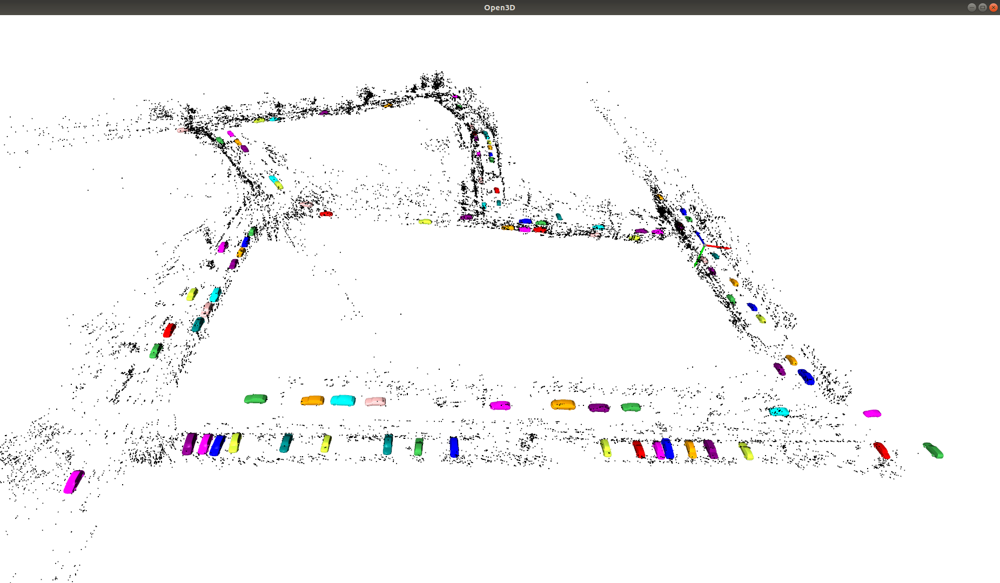
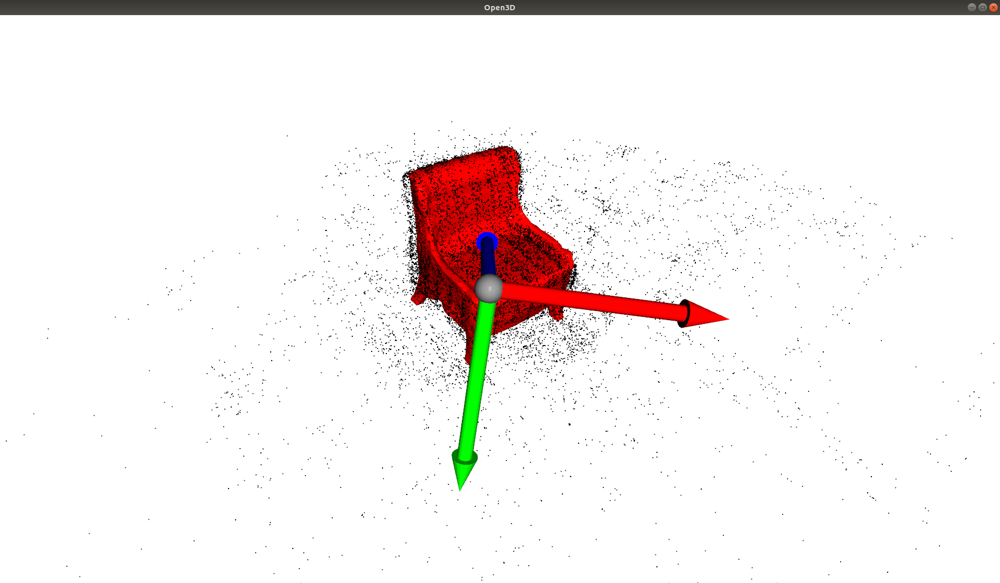
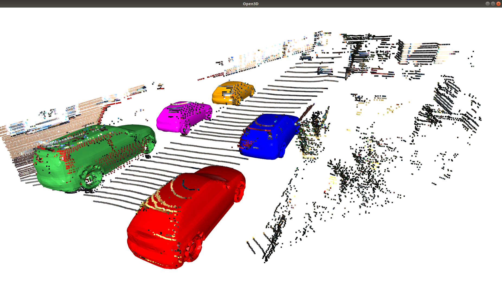

# HSNS-SLAM

https://www.youtube.com/watch?v=gf3xLTTU2hM

## Publication

@inproceedings{
  author={Lee Harim, Park Sungjun, Lee Yeojin},
  title={HSNS-SLAM},
  year={2024}
}

# 2. Building HSNS-SLAM

Clone the repository:
```
git clone --recursive https://github.com/JingwenWang95/DSP-SLAM.git
```

## Building script
For your convenience, we provide a building script `build_cuda102.sh` and `build_cuda113.sh` which show step-by-step how DSP-SLAM is built and which dependencies are required. Those scripts will install everything for you including CUDA (version is specified in the script name) and assume you have CUDA driver (support at least CUDA 10.2) and Anaconda installed on your computer. You can select whichever you want. `e.g.` If you your GPU is RTX-30 series which doesn't support CUDA 10 you can try with the one with CUDA 11.3. 

You can simply run:

```
./build_cuda***.sh --install-cuda --build-dependencies --create-conda-env
```

and it will set up all the dependencies and build DSP-SLAM for you. If you want to have a more flexible installation (use your own CUDA and Pytorch, build DSP-SLAM with your own version of OpenCV, Eigen3, etc), Those scripts can also provide important guidance for you.

https://www.youtube.com/watch?v=gf3xLTTU2hM

## CMake options:
When building DSP-SLAM the following CMake options are mandatory: `PYTHON_LIBRARIES`, `PYTHON_INCLUDE_DIRS`, `PYTHON_EXECUTABLE`. Those must correspond to the same Python environment where your dependencies (PyTorch, mmdetection, mmdetection3d) are installed. Make sure these are correctly specified!

Once you have set up the dependencies, you can build DSP-SLAM: 

```
# (assume you are under DSP-SLAM project directory)
mkdir build
cd build
cmake -DPYTHON_LIBRARIES={YOUR_PYTHON_LIBRARY_PATH} \
      -DPYTHON_INCLUDE_DIRS={YOUR_PYTHON_INCLUDE_PATH} \
      -DPYTHON_EXECUTABLE={YOUR_PYTHON_EXECUTABLE_PATH} \
      ..
make -j8
```

After successfully building DSP-SLAM, you will have **libDSP-SLAM.so**  at *lib* folder and the executables **dsp_slam** and **dsp_slam_mono** under project root directory.

# 3. Running DSP-SLAM

## Dataset
You can download the example sequences and pre-trained network model weights (DeepSDF, MaskRCNN, PointPillars) from [here](https://liveuclac-my.sharepoint.com/:f:/g/personal/ucabjw4_ucl_ac_uk/Eh3nHv6D-LZHkuny4iNOexQBGdDVxloM_nwbEZdxeRfStw?e=sYO1Ot). It contains example sequences of [KITTI](http://www.cvlibs.net/datasets/kitti/eval_odometry.php), [Freiburg Cars](https://github.com/lmb-freiburg/unsup-car-dataset) and [Redwood Chairs](http://redwood-data.org/3dscan/dataset.html?c=chair) dataset.

## Run dsp_slam and dsp_slam_mono

After obtaining the 2 binary executables, you will need to suppy 4 parameters to run the program: 1. path to vocabulary 2. path to .yaml config file 3. path to sequence data directory 4. path to save map. Before running DSP-SLAM, make sure you run `conda activate dsp-slam` to activate the correct Python environmrnt. Here are some example usages:

For KITTI sequence for example, you can run:

```
./dsp_slam Vocabulary/ORBvoc.bin configs/KITTI04-12.yaml data/kitti/07 map/kitti/07
```

For Freiburg Cars:

```
./dsp_slam_mono Vocabulary/ORBvoc.bin configs/freiburg_001.yaml data/freiburg/001 map/freiburg/001
```

For Redwood Chairs:

```
./dsp_slam_mono Vocabulary/ORBvoc.bin configs/redwood_09374.yaml data/redwood/09374 map/redwood/09374
```

## Save and visualize map

If you supply a valid path to DSP-SLAM as the 4-th argument, after running the program you should get 3 text files under that directory: Cameras.txt, MapObjects.txt and MapPoints.txt. MapObjects.txt stores the reconstructed object(s) as shape code and 7-DoF pose. Before you can visualize the map, you need to extract meshes from shape codes by running:

```
python extract_map_objects.py --config configs/config_kitti.json --map_dir map/07 --voxels_dim 64
```

It will create a new directory under map/07 and stores all the meshes and object poses there. Then you will be able to visualize the reconstructed joint map by running:

```
python visualize_map.py --config configs/config_kitti.json --map_dir map/07
```

Then you will be able to view the map in an Open3D window:

<p align="justify">
   
</p>

## Tips
### Try python script of single-shot reconstruction first
We provide a Python script [reconstruct_frame.py](reconstruct_frame.py) which does 3D object reconstruction from a single frame for KITTI sequences. Running it does not require any C++ stuff. Here is an example usage:
```
python reconstruct_frame.py --config configs/config_kitti.json --sequence_dir data/kitti/07 --frame_id 100
```
If you can run it smoothly you will see a Open3D window pop up. The figure below shows an example result:

<p align="justify">
  
</p>

### Run DSP-SLAM with offline detector
If you can successfully build DSP-SLAM but get errors from Python side when running the program, then you can try supplying pre-stored labels and run DSP-SLAM with offline detector. We have provided 2D and 3D labels for KITTI sequence in the [data](https://liveuclac-my.sharepoint.com/:f:/g/personal/ucabjw4_ucl_ac_uk/Eh3nHv6D-LZHkuny4iNOexQBGdDVxloM_nwbEZdxeRfStw?e=sYO1Ot). To run DSP-SLAM with offline mode, you will need to change the field `detect_online` in the .json config file to `false` and specify the corresponding label path.

### Label format
If you want to create your own labels with your own detectors, you can follow the same format as the labels we provided in the KITTI-07 sequence.
* 3D labels contains 3D detection boxes under [KITTI](http://www.cvlibs.net/datasets/kitti/eval_object.php?obj_benchmark=3d) convention. Each `.lbl` file consits of a numpy array of size Nx7, where N is the number of objects detected. Each row of the array is a 3D detection box: [x, y, z, w, l, h, ry]. More information about the KITTI coordinate system can be found from [mmdetection3d](https://github.com/open-mmlab/mmdetection3d) or [KITTI website](http://www.cvlibs.net/publications/Geiger2013IJRR.pdf).
* 2D labels contains MaskRCNN detection boxes and segmentation masks. Each `.lbl` file consists of of a dictionary with two keys: `pred_boxes` and `pred_masks`. Boxes and masks are stored as numpy array of size Nx4 and NxHxW.

### Run DSP-SLAM with mono sequence
If you have problem installing mmdetection3d but can run mmdetection smoothly, then you can start with mono sequences as they only require 2D detector.

# 4. License
DSP-SLAM includes the third-party open-source software ORB-SLAM2, which itself includes third-party open-source software. Each of these components have their own license. DSP-SLAM also takes a part of code from DeepSDF which is under MIT license: https://github.com/facebookresearch/DeepSDF.

DSP-SLAM is released under [GPLv3 license](LICENSE) in line with ORB-SLAM2. For a list of all code/library dependencies (and associated licenses), please see [Dependencies.md](Dependencies.md).

# 5. FAQ

### Resolve '***Segmentation Fault***'
First make sure you have activated the correct environment which is `dsp-slam` and run DSP-SLAM under the project root directory. See if that can resolve the SegFault.

Another major cause of SegFault is caused by mmdetection3d. If you encounter SegFault on KITTI sequence but can successfully run `dsp_slam_mono` on Freiburg Cars or Redwood Chairs, then the problem is probably because mmdetection3d is not correctly installed. Make sure you fully understand the steps in the building scripts and followed all the steps correctly.

### No response after running
Make sure you specified correct data path when running DSP-SLAM. 

### Resolve '***The experiment directory does not include specifications file "specs.json"***'
This error suggests that you provided wrong path for DeepSDF weights. All the [json config files](https://github.com/JingwenWang95/DSP-SLAM/blob/master/configs/config_kitti.json#L19) under `configs/` assume that weights are under stored `weights/`. Make sure you download the weights and put them under `weights/` or change the weight path in the json config files.

### Resolve '***ValueError: numpy.ndarray size changed, may indicate binary incompatibility***'
This error is caused by numpy version mismatch between mmdetection3d and pycocotools. This can be resolved by upgrade numpy version to >= 1.20.0. More info can befound from here: https://stackoverflow.com/questions/66060487/valueerror-numpy-ndarray-size-changed-may-indicate-binary-incompatibility-exp

### Resolve '***GLSL Shader compilation error: GLSL 3.30 is not supported***'
We render the reconstructed objects using GLSL, the error above won't affect the SLAM system running but you won't see objects show up in the window. You can try running ```export MESA_GL_VERSION_OVERRIDE=3.3``` before running DSP-SLAM. More info: https://stackoverflow.com/questions/52592309/0110-error-glsl-3-30-is-not-supported-ubuntu-18-04-c

# 6. Acknowledgements
Research presented here has been supported by the UCL Centre for Doctoral Training in Foundational AI under UKRI grant number EP/S021566/1. We thank [Wonbong Jang](https://sites.google.com/view/wbjang/home) and Adam Sherwood for fruitful discussions. We are also grateful to [Binbin Xu](https://www.doc.ic.ac.uk/~bx516/) and [Xin Kong](https://kxhit.github.io/) for their patient code testing!
